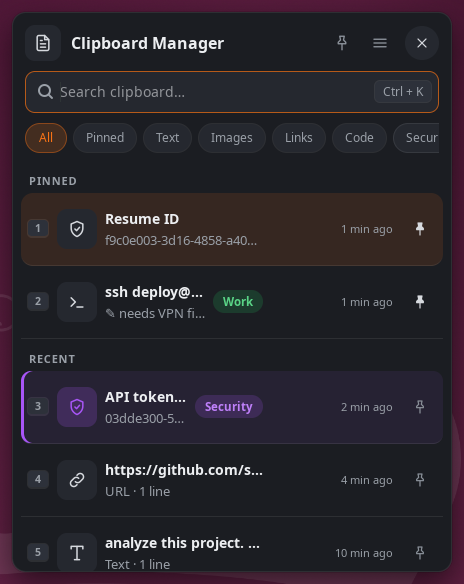

# Clipboard Manager

A clipboard history popup for Linux — press **Ctrl+Alt+C** to see everything
you've recently copied and paste any of it instantly. Text and images,
search, pins, labels, tags and colours. Works on **X11 and Wayland (GNOME)**.

Built natively with Rust and GTK4.

<p align="center"></p>

## Install

### One-line install (Ubuntu 22.04 / 24.04)
```bash
curl -fsSL https://raw.githubusercontent.com/sheheemmulakkal/clipboard-manager/master/install.sh | bash
```

Or download the `.deb` directly from the [Releases page](../../releases/latest).

### Requirements
- **Ubuntu 22.04 or newer** (amd64), or another distribution with GTK 4.6+
- **X11**: everything works out of the box.
- **Wayland (GNOME)**: the popup runs on XWayland so the history keeps
  recording in the background. The hotkey is added as a GNOME keyboard
  shortcut, and pasting goes through the Remote Desktop portal. GNOME asks
  **once** for permission to "control" the keyboard, the first time you paste.

## Usage

The app starts automatically after install. Copy as usual, then press
**Ctrl+Alt+C**.

| Action | How |
|---|---|
| **Paste** | Click a row, or select it and press **Enter** |
| **Quick paste** | **1**–**9** right after opening (keycaps show which), or **Alt+1**–**Alt+9** any time |
| **Search a number** | **Ctrl+K** or **/** first, then type (digits then go into the search) |
| **Search** | Just type — or **Ctrl+K** / **/** to jump to the search box |
| **Filter** | Chips under the search box: All · Pinned · Text · Images · Links · Code · your tags |
| **Preview** | **Space**, or the 👁 button on hover — full text or the whole image |
| **Copy / paste to terminal / delete** | Buttons appear when you hover over a row |
| **Pin** (never evicted, always on top) | The pin on the right of a row, or **Ctrl+P** |
| **Menu** | Right-click a row, **Menu** key or **Shift+F10** |
| **Edit title, text or note** | Menu → Edit, or **Ctrl+E** |
| **Note** (longer text, searchable) | Menu → Add note… — shown with ✎ under the item and in Preview |
| **Tag** (Work, Personal, Security, …) | Menu → Add label |
| **Colour** | Menu → Change colour — tints the whole row |
| **Delete** | **Delete** key, hover button, or menu |
| **Top / bottom** | **Home** / **End**, or the ↑ button that appears when you scroll |
| **Keep the popup open** | Pin icon in the header |
| **Pause recording, clear history, settings, quit** | ☰ menu in the header, or the tray icon |
| **Close** | **Esc** (first Esc clears the search) |

Copying something that is already in the history moves it back to the top —
no duplicates.

### Privacy

- The history and images are stored in `~/.local/share/clipboard-manager/`,
  readable only by you.
- Passwords copied from password managers that mark them as secret
  (KeePassXC, KWallet, …) are never recorded.
- Nothing copied while a password manager window is focused is recorded
  (`ignore_apps`, X11).
- **Pause capture** (menu, tray or `clipboard-manager pause`) stops
  recording until you resume.

## Command line

```text
clipboard-manager                start in the background (or open the popup if running)
clipboard-manager show           open the popup
clipboard-manager toggle         open or close the popup — bind this to a key on any desktop
clipboard-manager pause|resume   stop / restart recording
clipboard-manager clear          remove all unpinned items
clipboard-manager list [-n N]    print the most recent items
clipboard-manager reload         restart (re-reads config.toml)
clipboard-manager quit           stop
```

## Screenshots and images

Copied images (screenshots, images from a browser or editor) are captured
automatically. The popup shows a thumbnail, and pasting puts the full image
back on the clipboard. Images are deduplicated by SHA-256 and stored as PNG
files in `~/.local/share/clipboard-manager/images/`. Images larger than 4K
are skipped.

## Configuration

`~/.config/clipboard-manager/config.toml` is created on first run with every
option documented (☰ → Settings opens it). Apply changes with
`clipboard-manager reload`.

```toml
max_history       = 50
hotkey            = "ctrl+alt+c"
theme             = "dark"        # "dark", "light" or "system"
popup_width       = 440
popup_height      = 560
expire_after_days = 0             # delete unpinned items older than N days
tray_icon         = true
ignore_apps       = ["keepassxc", "1password", "bitwarden"]
```

Colours and sizes can be overridden in `[colors]` and `[sizes]` sections —
see the generated file.

## Data files

| File | Purpose |
|---|---|
| `~/.config/clipboard-manager/config.toml` | Configuration |
| `~/.local/share/clipboard-manager/history.bin` | History (text, pins, labels, tags, colours) |
| `~/.local/share/clipboard-manager/images/` | Captured images and thumbnails |
| `~/.local/state/clipboard-manager/clipboard-manager.log` | Log of the background process |
| `~/.local/state/clipboard-manager/portal-restore-token` | Wayland paste permission |

## Upgrade

Run the install command again, or install a newer `.deb`:

```bash
sudo apt install ./clipboard-manager_*.deb
```

History, config and pins are preserved. History files from older versions
are read transparently.

## Uninstall
```bash
sudo apt remove clipboard-manager
```
This stops the app, removes autostart entries and the GNOME shortcut, and
deletes `~/.config/clipboard-manager/`, `~/.local/share/clipboard-manager/`
and `~/.local/state/clipboard-manager/`.

## Build from source
```bash
sudo apt install libgtk-4-dev libglib2.0-dev libx11-dev libxtst-dev \
  libgdk-pixbuf-2.0-dev librsvg2-common pkg-config build-essential

cargo build --release
cargo test

# installable .deb
cargo install cargo-deb
cargo deb
```

## Development

```bash
# Foreground with logs, as a separate instance next to an installed one
CLIPBOARD_MANAGER_PROFILE=dev RUST_LOG=debug cargo run

# Fully isolated: nested X server, own D-Bus and data directories
cargo build && scripts/dev-run.sh
```

See [ARCHITECTURE.md](ARCHITECTURE.md) and [CONTRIBUTING.md](CONTRIBUTING.md).

## License
MIT
